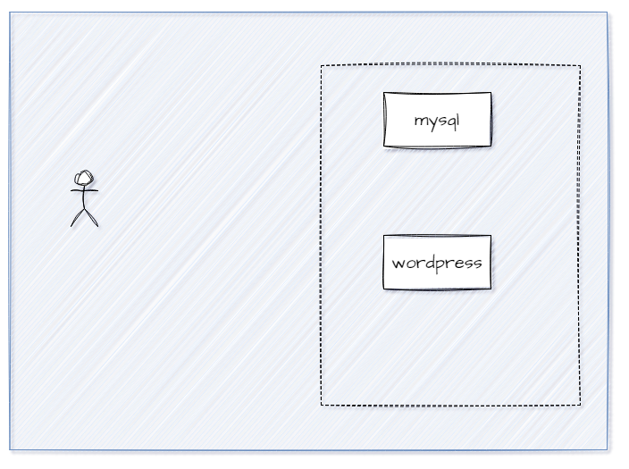

## Docker Compose

Docker Compose permite definir la configuración de todos los servicios de una aplicación en un solo archivo **compose.yaml**.
**Archivo compose.yaml**
En este archivo  se define los servicios que componen la aplicación. 
Cada servicio puede incluir la imagen a usar, los puertos a exponer, los volúmenes a montar y otras configuraciones.
- Cada servicio se ejecuta en su propio contenedor. 
- Facilita la gestión y el mantenimiento de la configuración, en comparación con la gestión de múltiples archivos de configuración de Docker o scripts de shell. 
- Ayuda a tener consistencia en los entornos de desarrollo, pruebas y producción.


## Ejercicio
El archivo compose.yaml permitirá configurar dos servicios de acuerdo con el siguiente esquema:



### Revise el archivo archivo compose.yaml y complete solamente las partes que solicita <valor>, estas partes corresponden a
- Las variables de entorno para cada uno de los servicios
- Mapeo de puertos para wordpress 
**La dependencia entre el servicio de wordpress y la base de datos, se indica en la línea 44**
- depends_on: Establece dependencias entre servicios. El servicio actual **wordpress-service** depende del servicio **mysql-service**.
- condition: service_healthy significa que el servicio actual solo se iniciará después de que el servicio mysql-service esté en un estado saludable, es decir, después de que pase su healthcheck.
- Healthcheck de cada uno de los servicios.
- Se requiere que Wordpress se encuentre disponible en todo momento, defina una política de reinicio adecuada para esto (línea 44)

### Ejecutar Docker compose
Este comando descargará las imágenes necesarias, creará y ejecutará los contenedores según lo definido en el archivo compose.yaml
Para ejecutar en modo "detached" (en segundo plano) se agrega la opción -d:
```
docker compose up -d
```

### Ejecutar Docker compose para servicios que no se crearon correctamente
Si algún servicio no se creó correctamente se puede usar
```
docker compose up -d <nombre servicio>
```

### Listar contenedores en ejecución que se crearon por docker compose
```
docker compose ps
```

### Detener y eliminar los contenedores definidos en el archivo
```
docker compose down
```